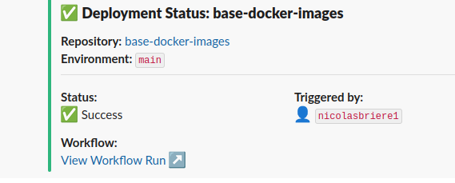
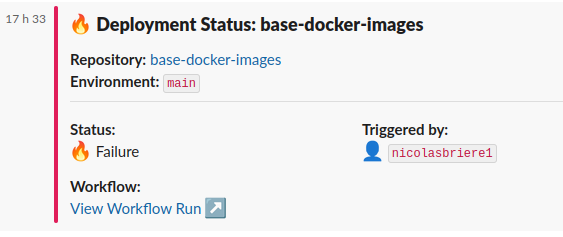

# Slack Github Actions Status Workflow

This workflow provides a standardized interface for sending GitHub Actions deployment status messages to Slack channels, with a predefined message format that includes repository, environment, and deployment details.

## Usage

```yaml
jobs:
  notify:
    uses: ZeroGachis/.github/.github/workflows/send_slack_gha_status.yaml@v4
    with:
      channel_id: "C0123456789"
      environment_name: production
      status: success # Optional, defaults to "success"
    secrets: inherit
```

## Inputs

### Required Inputs

| Input              | Description                                                                        |
| ------------------ | ---------------------------------------------------------------------------------- |
| `channel_id`       | Slack channel ID to send the message to (Can be find in Channel info in Slack app) |
| `environment_name` | Target environment for Vault configuration                                         |

### Optional Inputs

| Input                       | Default   | Description                                                  |
| --------------------------- | --------- | ------------------------------------------------------------ |
| `vault_url`                 | -         | Vault server URL                                             |
| `vault_github_actions_role` | -         | Role to use for Vault authentication                         |
| `status`                    | "success" | Deployment status ("success" or any other value for failure) |

## Features

- 🚀 Standardized deployment status messages
- 📊 Rich message formatting with repository and deployment details
- 👤 Automatic inclusion of triggering user
- 🔗 Direct links to workflow run and commit
- 🎨 Color-coded status indicators
- 🔒 Secure credential management via HashiCorp Vault
- 🌐 Environment-specific configuration

## Example Usage

### Basic Status Message

```yaml
jobs:
  notify-success:
    uses: ZeroGachis/.github/.github/workflows/send_slack_gha_status.yaml@v4
    with:
      channel_id: "C0123456789"
      environment_name: staging
      status: success
    secrets: inherit
```

### Failure Status Message

```yaml
jobs:
  deploy:
    runs-on: ubuntu-latest
    steps:
      - name: Deploy application
        run: ./deploy.sh

  notify-failure:
    needs: deploy
    if: failure()
    uses: ZeroGachis/.github/.github/workflows/send_slack_gha_status.yaml@v4
    with:
      channel_id: "C0123456789"
      environment_name: production
      status: failure
    secrets: inherit
```

This example shows how to automatically send a failure notification when a job fails. The `if: failure()` condition ensures the notification is only sent if the `deploy` job fails.

### Message Example



_Example of a successful deployment status message in Slack_



_Example of a failed deployment status message in Slack_

### Message Format

The message includes:

- Repository name and link
- Environment name
- Deployment status (with emoji indicators)
- Triggering user
- Links to workflow run and commit
- Color-coded status (green for success, red for failure)


_Example of a deployment status message in Slack_
