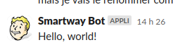

# Slack Message Workflow

This workflow provides a simplified interface for sending messages to Slack channels, building upon the Slack Notification workflow with a more focused set of inputs.

## Usage

```yaml
jobs:
  notify:
    uses: ZeroGachis/.github/.github/workflows/send_slack_message.yaml@v4
    with:
      channel_id: "C0123456789"
      message: "Deployment completed successfully!"
      environment_name: production
    secrets: inherit
```

## Inputs

### Required Inputs

| Input              | Description                                |
| ------------------ | ------------------------------------------ |
| `channel_id`       | Slack channel ID to send the message to    |
| `message`          | Message content to send                    |
| `environment_name` | Target environment for Vault configuration |

### Optional Inputs

| Input                       | Default | Description                          |
| --------------------------- | ------- | ------------------------------------ |
| `vault_url`                 | -       | Vault server URL                     |
| `vault_github_actions_role` | -       | Role to use for Vault authentication |

## Features

- 💬 Simple message sending interface
- 🔒 Secure credential management
- 🔑 HashiCorp Vault integration
- 🌐 Environment-specific configuration
- 📝 Markdown message formatting support

## Example Usage

### Basic Message

```yaml
jobs:
  notify:
    uses: ZeroGachis/.github/.github/workflows/send_slack_message.yaml@v4
    with:
      channel_id: "C0123456789"
      message: "Build completed successfully!"
      environment_name: staging
    secrets: inherit
```

### Message Example



_Example of a simple "Hello World!" message in Slack_
